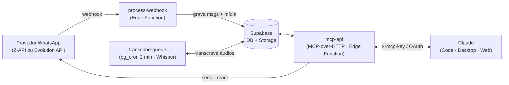

# WhatsApp Agent

**v3.0.0** · [Changelog](CHANGELOG.md) · [Guia de migração](MIGRATION.md) · [Documentação de referência](docs/reference/)

**Seu WhatsApp, operado por IA.** Um backend headless que conecta o seu número de WhatsApp ao Claude — que lê, resume, transcreve áudios, categoriza contatos e responde por você, tudo em linguagem natural.

**[→ Como funciona o WhatsApp Agent](https://expert-integrado.github.io/whatsapp-agent/)** — a página do projeto, com o sistema explicado visualmente.

Open source, parte da mentoria **Expert Integrado**. Você conversa com o Claude — *"do que eu tô devendo resposta?"*, *"resume a conversa com o Pedro"*, *"responde pro cliente que fecho amanhã"* — e ele opera o seu WhatsApp através de um pipeline Z-API → Supabase → MCP.

**O que ele faz:**

- 📥 Captura tudo (texto, áudio, imagem, vídeo, documento) num banco que é **seu**
- 🎙️ Transcreve áudios automaticamente (OpenAI Whisper)
- 🧠 Responde perguntas sobre as suas conversas em linguagem natural
- ✍️ Envia, responde, reage e edita mensagens pelo Claude
- 🏷️ Categoriza e anota contatos (cliente, prospect, família…)
- 🔒 **Single-tenant:** cada instalação é o seu WhatsApp, no seu Supabase. Nenhum dado sai do seu controle.

---

## Instalação

### Pré-requisitos

Três contas — todas com plano gratuito suficiente pra começar:

| Serviço | Pra quê | O que você vai precisar |
|---|---|---|
| **[Supabase](https://supabase.com)** | Banco, storage e edge functions | Project ref + URL, a **secret key** (`sb_secret_…`) e um Personal Access Token (PAT) |
| **[Z-API](https://z-api.io)** (ou Evolution API) | Gateway do WhatsApp | Z-API: `instance_id`, `auth_token`, `client_token` — e o seu número conectado via QR code. Evolution: URL do seu servidor + API key. Veja [Provedores de WhatsApp](#provedores-de-whatsapp-z-api-vs-evolution-api). |
| **[OpenAI](https://platform.openai.com)** | Transcrição de áudio (Whisper) | API key |
| **[ElevenLabs](https://elevenlabs.io)** *(opcional)* | Mensagens de voz — `send_voice` transforma texto em áudio PTT | API key + o **voice ID** da voz escolhida (clone da sua voz ou voz do acervo) |

Ferramentas locais: **[Claude Desktop](https://claude.ai/download)** (Claude Code embutido, na aba **Code**) e o **[Supabase CLI](https://supabase.com/docs/guides/cli)** (o setup instala se faltar — instruções por OS na skill `setup`). **Não precisa de Node** — o runtime mora no Supabase.

A instalação tem **dois planos bem separados**:

- **Setup / deploy** (esta seção) → roda pelo **Supabase CLI**, como um desenvolvedor faria: provisiona o banco e as Edge Functions no *seu* Supabase. Você faz uma vez.
- **Operação** ([próxima seção](#manual-de-uso)) → o **MCP remoto** conectado ao seu harness. Não precisa do repositório nem do CLI rodando.

O Claude conduz o setup pra você; você só fornece as credenciais.

1. Clone o repositório e abra o **Claude Code** (no app **Claude Desktop**, aba **Code**) na pasta:

   

2. **Rode a skill `/setup`** (project skill em [`.claude/skills/setup`](.claude/skills/setup/SKILL.md), detectada automaticamente ao abrir a pasta no Claude Code) — ou cole o prompt abaixo. Ela instala o Supabase CLI se faltar, coleta suas credenciais (só no `.env` local, gitignored), aplica as migrations, configura os secrets, deploya as Edge Functions e te entrega a conexão do MCP:

```text
Instale o WhatsApp Agent neste repositório, do zero, seguindo a skill setup
(.claude/skills/setup/SKILL.md) e o protocolo de onboarding do CLAUDE.md. Antes de
começar, verifique os pré-requisitos (Supabase CLI + contas). Use o Supabase CLI pra
tudo do Supabase — supabase link, db push, secrets set, functions deploy. Pra CADA
etapa de navegador (criar conta/instância na Z-API e conectar o número via QR code,
criar o projeto Supabase e gerar PAT/chaves, criar a API key da OpenAI, escolher a voz
na ElevenLabs), pergunte com botões (AskUserQuestion): "Essa etapa é no navegador.
Quer que eu faça pra você?" — rota default: você faz via Playwright MCP (se faltar,
instale com: claude mcp add playwright -- npx -y @playwright/mcp@latest); alternativas:
Claude in Chrome, ou me guiar no passo a passo manual. Login é sempre comigo — nunca
peça senha no chat. Valide cada credencial com uma chamada real antes de seguir.
Conduza passo a passo, pedindo uma credencial de cada vez e guardando-as SÓ no .env
local (gitignored) — nunca commite. No fim, me dê a URL da mcp-api + a MCP_API_KEY pra
eu conectar o MCP no meu harness, rode o teste E2E (a tool `status`) e me entregue um
resumo do que ficou configurado.
```

> As credenciais dos serviços (Z-API, OpenAI) vão pros **secrets do Supabase** (`supabase secrets set`) — é lá que as Edge Functions as leem. O `.env` local é só o veículo do setup; o runtime não depende dele.

---

## Manual de uso

Pra **operar**, conecte o **MCP remoto** (`https://SEU_PROJECT_REF.supabase.co/functions/v1/mcp-api`) no seu harness, uma vez. É um servidor MCP padrão — funciona em **qualquer app de IA com suporte a MCP**, não só no Claude. Dois caminhos de autenticação, conforme o app:

- **Claude Code** (inclui a aba **Code** do Desktop) — header key: o `.mcp.json` deste repo já tem o esqueleto; defina `WHATSAPP_AGENT_MCP_URL` (a URL da sua `mcp-api`) e `MCP_API_KEY` no ambiente.
- **Claude Desktop (chat) ou Claude Web** (claude.ai) — **OAuth**: Settings → Connectors → *Add custom connector* → cole a URL → em *Advanced settings*, informe o **Client ID + Client Secret** que o setup gerou pra você → conectar. (A tela de Connectors não aceita header custom; o OAuth é auto-aprovado, sem tela extra.)

Conectado, você opera o WhatsApp **conversando com o Claude em linguagem natural** — sem comandos nem skills pra instalar. O **MCP expõe 23 ferramentas** que o Claude aciona conforme o que você pede:

| Você diz… | Tool |
|---|---|
| *"Do que eu tô devendo resposta?"* | `inbox` (`waiting_on:me`, `min_idle_days` → ordena por mais parado) |
| *"O que tem de novo no WhatsApp?"* | `inbox` |
| *"Transcreve / resume a conversa com o Pedro"* | `read` (já transcreve os áudios pendentes) |
| *"Responde pro cliente que fecho amanhã"* | `send` (confirma antes de enviar) |
| *"Procura onde falaram de orçamento"* | `search` |
| *"Categoriza esse chat como cliente"* | `categorize_chat` |
| *"Reage com 👍 na última do Pedro"* | `react` |
| *"Manda um áudio pra Ana"* (texto vira voz, na voz default da instância) | `send_voice` |
| *"Esse aí não precisa responder"* / *"me lembra semana que vem"* | `resolve_chat` (implícito — o agente entende o sinal) |

Como são **ferramentas MCP** (não skills), funcionam igual em qualquer app de IA com suporte a MCP.

### Perfil de voz por contato (recomendado)

O agente escreve melhor em seu nome quando sabe **como cada pessoa te chama e como você chama cada uma** (mano? doutor? pelo nome?). Isso mora em `chats.voice_profile`, que as tools `read`/`send` já usam pra espelhar o tom ao redigir. Dois passos:

1. **Backfill (uma vez):** abra a pasta do repo no Claude Code e peça *"roda o backfill de voice profile"* — a skill [`voice-profile-backfill`](skills/voice-profile-backfill/SKILL.md) varre o seu histórico, monta um piloto pra você revisar e depois processa o resto.
2. **Nutrição (rotina semanal local):** uma vez por semana, com o computador ligado, peça *"roda a nutrição de voice profile"*. O modo `--nutricao` pega só o delta da semana (contatos novos + perfis com mensagens novas) — leva minutos. Como os dados moram no **seu Supabase**, qualquer máquina serve; não precisa de servidor ligado 24/7. Se a semana pular, rode com `--days 14` que o delta cobre o acumulado.

### A sua voz em áudio (opcional)

Com uma conta [ElevenLabs](https://elevenlabs.io), *"manda um áudio pra Ana"* vira uma mensagem de voz de verdade (PTT). Duas escolhas na instalação:

1. **Qual voz?** No [Voice Lab](https://elevenlabs.io/app/voice-lab), **clone a sua própria voz** (1-2 min de áudio limpo — o resultado é o áudio saindo como se fosse você) ou escolha uma voz do acervo.
2. **Grave-a como default:** o voice ID escolhido vai em `wa_instance.default_voice_id` (a skill `/setup` conduz). A partir daí o `send_voice` usa essa voz sempre — sem precisar informar `voice_id` a cada pedido.

### Como o agente decide "quem está devendo resposta"

O `inbox` classifica cada conversa por `waiting_on` — quem falou por último define quem deve. As regras, já embutidas (você não precisa configurar nada):

- **Grupos ficam fora** da semântica de pendência (qualquer membro falando marcaria você como devedor — ruído puro).
- **Resolvido implícito:** ao sinalizar de qualquer jeito que uma conversa está encerrada (*"ignora esse"*, *"não precisa responder"*, *"já resolvi"*), o agente marca o chat como resolvido na hora — sem comando decorado. Se a pessoa mandar mensagem nova, o chat **reabre sozinho**.
- **Snooze:** *"me lembra semana que vem"* esconde o chat até a data (ou até a pessoa responder — o que vier primeiro).
- **Dormentes:** conversas paradas há 90+ dias não poluem o inbox por padrão (`include_dormant:true` mostra).

---

## Provedores de WhatsApp (Z-API vs Evolution API)

A partir da v3.0, cada instância WhatsApp escolhe o provedor no campo `provider` da tabela `wa_instance`. Os dois são suportados simultaneamente no mesmo banco.

| | Z-API | Evolution API |
|---|---|---|
| Hospedagem | Hospedado (SaaS) | Self-hosted (você sobe o servidor) |
| Custo | Pago (plano Z-API) | Open-source, gratuito |
| Pré-requisito | Conta em [z-api.io](https://z-api.io) | Servidor Evolution rodando + URL acessível |
| Configuração | `instance_id`, `auth_token`, `client_token` | `base_url` do servidor, `auth_token` (API key) |
| Quando usar | Padrão recomendado — sem infra extra | Quando você já tem (ou quer) seu próprio servidor Evolution |

**Instâncias existentes (migradas da v2.x)** continuam funcionando como Z-API sem nenhuma reconfiguração.

Para adicionar uma instância **Evolution API**, insira uma linha em `wa_instance` com `provider = 'evolution'` e o `base_url` do seu servidor. A skill `/setup` conduz o processo — veja [`.claude/skills/setup`](.claude/skills/setup/SKILL.md).

---

## Arquitetura



Três serviços, com o Supabase como **runtime**:

- **Provedor WhatsApp** — gateway do WhatsApp. Pode ser **Z-API** (hospedado, pago) ou **Evolution API** (self-hosted, open-source), selecionável por instância. Recebe as suas mensagens (webhook → `process-webhook`) e envia as respostas via `wa-proxy`.
- **Supabase** — o coração **e o runtime**. Postgres (mensagens, chats, contatos, categorias), Storage (6 buckets de mídia), Edge Functions (Deno) e `pg_cron` (transcrição a cada 2 min, limpeza). Entre as functions está a **`mcp-api`: o MCP server falando HTTP** — é ela que expõe as 23 tools. 43 migrations versionadas.
- **OpenAI** — Whisper, pra transcrever os áudios.
- **Harness** — qualquer Claude (Code, Desktop ou Web) conecta na `mcp-api`. O Claude Code usa **`x-mcp-key`**; o chat do Desktop/Web usa **OAuth** (a própria `mcp-api` é o Authorization Server — confidential client + PKCE, auto-aprovado, sem tela). Não há processo local: o MCP roda no Supabase.

**Fluxo:** a mensagem chega no provedor (Z-API ou Evolution) → `process-webhook` grava no Supabase (24/7) → o cron transcreve os áudios → você opera conversando com o Claude, que fala com a `mcp-api` (HTTP), que lê o banco e responde pelo seu WhatsApp.

> Single-tenant por design: rode a sua própria instância Z-API e projeto Supabase. A `service_role`/secret key (que bypassa o RLS) vive só server-side — nos secrets das Edge Functions — nunca no repositório. O acesso ao MCP é protegido pela `MCP_API_KEY` (header `x-mcp-key`).
