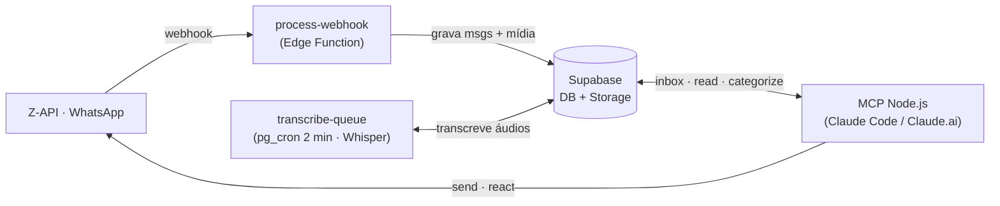

# WhatsApp Agent

**Seu WhatsApp, operado por IA.** Um backend headless que conecta o seu número de WhatsApp ao Claude — que lê, resume, transcreve áudios, categoriza contatos e responde por você, tudo em linguagem natural.

Open source, parte da mentoria **Expert Integrado**. Você conversa com o Claude — *"do que eu tô devendo resposta?"*, *"resume a conversa com o Pedro"*, *"responde pro cliente que fecho amanhã"* — e ele opera o seu WhatsApp através de um pipeline Z-API → Supabase → MCP.

**O que ele faz:**

- 📥 Captura tudo (texto, áudio, imagem, vídeo, documento) num banco que é **seu**
- 🎙️ Transcreve áudios automaticamente (OpenAI Whisper)
- 🧠 Responde perguntas sobre as suas conversas em linguagem natural
- ✍️ Envia, responde, reage e edita mensagens pelo Claude
- 🏷️ Categoriza e anota contatos (cliente, prospect, família…)
- 🔒 **Single-tenant:** cada instalação é o seu WhatsApp, no seu Supabase. Nenhum dado sai do seu controle.

---

## Instalação

### Pré-requisitos

Três contas — todas com plano gratuito suficiente pra começar:

| Serviço | Pra quê | O que você vai precisar |
|---|---|---|
| **[Supabase](https://supabase.com)** | Banco, storage e edge functions | Project URL, `service_role` key e um Personal Access Token (PAT) |
| **[Z-API](https://z-api.io)** | Gateway do WhatsApp | `instance_id`, `token`, `client_token` — e o seu número conectado via QR code |
| **[OpenAI](https://platform.openai.com)** | Transcrição de áudio (Whisper) | API key |

Ferramentas locais: **[Claude Desktop](https://claude.ai/download)** (já traz o Claude Code embutido, na aba **Code**) e **Node.js ≥ 18**.

### Instalar com o Claude Code (app Claude Desktop)

A instalação é conduzida pelo **Claude Code dentro do app Claude Desktop** — sem abrir terminal e sem precisar configurar git na máquina; o próprio Claude baixa o repositório.

1. Instale e abra o **[Claude Desktop](https://claude.ai/download)**.
2. No topo da janela, abra a aba **Code**:

   

3. Crie um novo projeto na pasta onde você quer instalar (pode ser uma pasta vazia).
4. **Cole o prompt abaixo** e siga as perguntas — ele baixa o repositório e conduz toda a instalação (credenciais → banco → edge functions → MCP → webhooks → skills → teste):

```text
Clone o repositório https://github.com/Expert-Integrado/whatsapp-agent.git e instale
o WhatsApp Agent pra mim, do zero. Conduza passo a passo, pedindo uma informação de
cada vez e validando cada etapa antes de seguir. NUNCA escreva minhas credenciais em
arquivos versionados nem faça commit delas — credenciais só no .env local (gitignored).

Depois de clonar, leia README.md, .env.example e explore supabase/ (migrations +
functions) e mcp/ pra entender a arquitetura. Em seguida execute nesta ordem:

1. CREDENCIAIS — peça e guarde num .env local:
   - Supabase: SUPABASE_URL, SUPABASE_SERVICE_ROLE_KEY, SUPABASE_PAT (Personal Access Token)
   - Z-API: ZAPI_INSTANCE_ID, ZAPI_TOKEN, ZAPI_CLIENT_TOKEN
   - OpenAI: OPENAI_API_KEY

2. BANCO — aplique todas as migrations de supabase/migrations/ no meu projeto, em
   ordem, via Supabase Management API (POST /v1/projects/{ref}/database/query). Antes,
   substitua o placeholder <SUPABASE_SERVICE_ROLE_KEY> nas migrations de cron pelo
   meu service_role e configure os app.settings indicados no .env.example.

3. EDGE FUNCTIONS — faça deploy de todas as functions de supabase/functions/ via
   Management API, respeitando o verify_jwt de cada uma em supabase/config.toml.

4. MCP — rode npm install em mcp/ e configure o .mcp.json com as minhas env vars
   pra eu conectar o servidor no Claude Code.

5. WEBHOOKS — configure minha instância Z-API pra enviar os webhooks (mensagem
   recebida, status de envio, etc.) pra URL da edge function process-webhook.

6. SKILLS — copie as skills de skills/ pra ~/.claude/skills/.

No fim, teste ponta a ponta: me peça pra mandar uma mensagem de teste, confirme que
ela chegou no banco e use a tool `status` do MCP pra validar a conexão. Resuma o que
ficou configurado e o que ainda depende de mim.
```

> O agente conduz, mas **você** aprova cada passo. Tenha as três contas criadas antes de começar.

---

## Manual de uso

Depois de instalado, você opera o WhatsApp **conversando com o Claude**. Duas skills cobrem os usos mais comuns:

### `estou-devendo` — o que está esperando resposta

Lista as conversas onde o **contato** mandou a última mensagem e você ainda não respondeu. Exclui grupos, filtra por categoria e ordena por quem espera há mais tempo.

```
estou-devendo
estou-devendo --categoria=cliente,prospect --dias=2
estou-devendo --excluir=descartar,comunidade --limit=10
```

### `transcrever-conversa` — resumo de conversa com áudios

Baixa os áudios de uma conversa, transcreve (Whisper) e devolve o histórico cronológico pronto pra resumir.

```
/transcrever-conversa "Jorge Pretel"
/transcrever-conversa Camila --dias 60
```

Além das skills, o **MCP expõe ~20 ferramentas** de operação que o Claude aciona quando você pede em linguagem natural:

| Você diz… | Tool |
|---|---|
| *"O que tem de novo no WhatsApp?"* | `inbox` |
| *"Lê a conversa com o Pedro"* | `read` |
| *"Responde pro cliente que fecho amanhã"* | `send` (confirma antes de enviar) |
| *"Procura onde falaram de orçamento"* | `search` |
| *"Categoriza esse chat como cliente"* | `categorize_chat` |
| *"Reage com 👍 na última do Pedro"* | `react` |

---

## Arquitetura



Quatro serviços se integram:

- **Z-API** — gateway do WhatsApp. Recebe as suas mensagens (webhook → `process-webhook`) e envia as respostas.
- **Supabase** — o coração. Postgres (mensagens, chats, contatos, categorias), Storage (6 buckets de mídia), 9 Edge Functions (Deno) e `pg_cron` (transcrição a cada 2 min, limpeza de mídia). 26 migrations versionadas.
- **OpenAI** — Whisper, pra transcrever os áudios.
- **MCP Node.js** — a ponte pro Claude. Expõe ~20 tools (em `mcp/`) que leem/escrevem no Supabase e enviam via Z-API.

**Fluxo:** a mensagem chega na Z-API → `process-webhook` grava no Supabase → o cron transcreve os áudios → você opera tudo conversando com o Claude, que lê o banco e responde pelo seu WhatsApp.

> Single-tenant por design: rode a sua própria instância Z-API e projeto Supabase. O `service_role` (que bypassa o RLS) vive só server-side e nas suas env vars locais — nunca no repositório.
