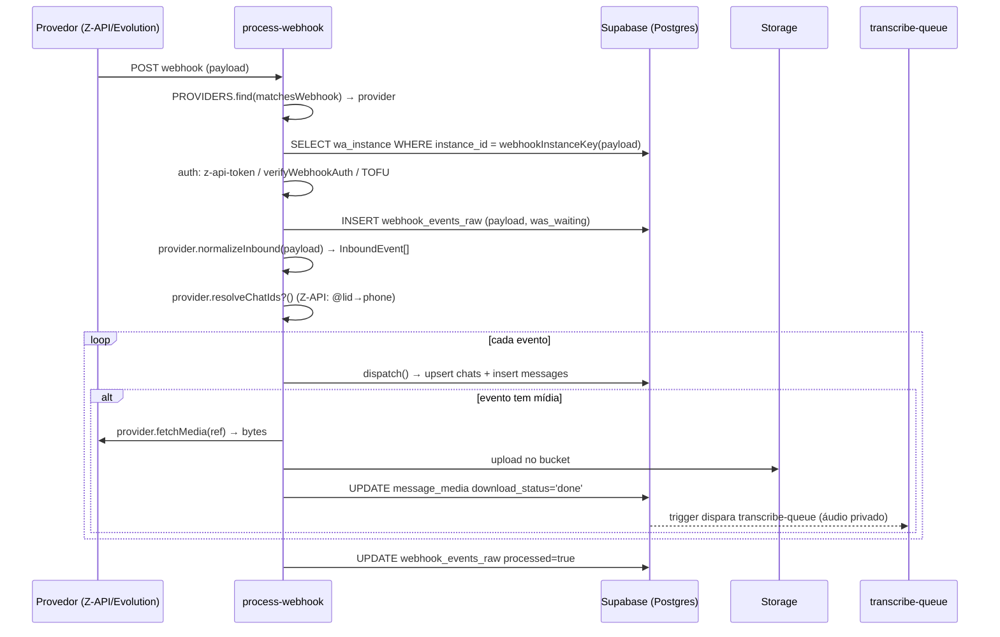
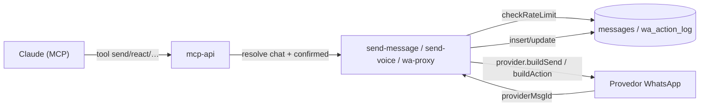
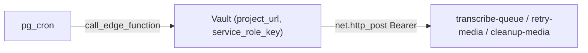

# Arquitetura e fluxo de mensagens

Como os dados descritos em [SCHEMA.md](SCHEMA.md) são escritos e lidos: as Edge Functions (Deno), o caminho de uma mensagem recebida, o de uma mensagem enviada, o padrão de provider (Z-API × Evolution) e os jobs de fundo. **Fonte:** [`supabase/functions/`](../../supabase/functions/) e [`supabase/config.toml`](../../supabase/config.toml).

---

## Mapa das Edge Functions

Todas rodam no Supabase (Deno). `verify_jwt` vem de [`config.toml`](../../supabase/config.toml).

| Função | Gatilho | `verify_jwt` | O que faz |
|---|---|---|---|
| [`process-webhook`](../../supabase/functions/process-webhook/index.ts) | Webhook do provedor | **false** | **Entrada principal.** Recebe o webhook, detecta o provider, autentica (TOFU), grava em `webhook_events_raw`, normaliza e persiste em `chats`/`messages`/`message_media`/etc. |
| [`mcp-api`](../../supabase/functions/mcp-api/index.ts) | MCP (Claude) | **false** | **Gateway MCP-over-HTTP.** Expõe ~20 tools, autentica via `x-mcp-key` ou OAuth. Ver [MCP.md](MCP.md) |
| [`send-message`](../../supabase/functions/send-message/index.ts) | MCP / HTTP | true | **Saída principal.** Envia texto/mídia via provider, com `confirmed=true` + rate-limit + atualização de `messages` |
| [`send-voice`](../../supabase/functions/send-voice/index.ts) | MCP / HTTP | true | Gera TTS (ElevenLabs, OGG/Opus) → Storage → envia como PTT |
| [`wa-proxy`](../../supabase/functions/wa-proxy/index.ts) | MCP / HTTP | true | Ações agnósticas (status, chats, contacts, reações, deletes, ops de grupo) via allowlist de 18 actions + auditoria em `wa_action_log` |
| [`transcribe-queue`](../../supabase/functions/transcribe-queue/index.ts) | cron (2 min) + trigger (`?id=`) | true | Transcreve áudios `ptt`/`audio` privados via OpenAI Whisper; grava em `messages.content` |
| [`retry-media`](../../supabase/functions/retry-media/index.ts) | cron (15 min) | true | Re-tenta downloads de mídia com `download_status='pending'` |
| [`cleanup-media`](../../supabase/functions/cleanup-media/index.ts) | cron (diário) | true | Remove mídia pesada antiga do Storage |
| [`sync-google-contacts`](../../supabase/functions/sync-google-contacts/index.ts) | — | true | Legado (sync Google Contacts; tabelas removidas na 0023) |

> As funções com `verify_jwt=true` exigem o JWT da `service_role` (é assim que o `pg_cron` as chama, via `call_edge_function` + Vault). `process-webhook` e `mcp-api` ficam com `verify_jwt=false` porque têm autenticação **própria** (token de webhook por instância e `x-mcp-key`/OAuth, respectivamente).

---

## Onde as mensagens caem (fluxo inbound)

Quando alguém te manda uma mensagem, o provedor dispara um webhook para [`process-webhook`](../../supabase/functions/process-webhook/index.ts). O caminho:

Pontos-chave do código ([`process-webhook/index.ts`](../../supabase/functions/process-webhook/index.ts)):

1. **Detecção de provider** — `PROVIDERS.find(p => p.matchesWebhook(payload))` testa Z-API e depois Evolution. Sem match → loga "Unhandled webhook" e ignora.
2. **Resolução de credenciais** — `provider.webhookInstanceKey(payload)` extrai o `instance_id`, que busca a linha em `wa_instance` (colunas `provider, instance_id, base_url, auth_token, client_token, alias, webhook_token`).
3. **Autenticação** (quando `WEBHOOK_REQUIRE_AUTH=true`): (a) header `z-api-token` == `ZAPI_WEBHOOK_TOKEN` (compat), ou (b) `provider.verifyWebhookAuth()`, ou (c) **TOFU** — só Z-API: uma instância registrada sem `webhook_token` salvo **aprende** o token da primeira requisição. Falhou tudo → `401`.
4. **Log bruto sempre** — `INSERT webhook_events_raw` antes de processar (com `was_waiting` quando o WhatsApp Multi-Device ainda não decriptou).
5. **Normalização + dispatch** — `normalizeInbound()` devolve `InboundEvent[]` neutros; `resolveChatIds?()` (só Z-API) resolve `@lid`→telefone; cada evento passa por `dispatch()`.
6. **Persistência por tipo** (`dispatch`): `message` → `persistMessage` (upsert `chats` + insert `messages`, e `last_sent_at`/`last_received_at` conforme `from_me`); `status` → atualiza `send_status`; `reaction` → `message_reactions`; `edit` → `messages`+`message_edits`; `revoke` → `is_deleted`; `group_participant` → `group_participants`; `connection` → `wa_instance`.
7. **Mídia** — `downloadMediaToStorage` insere `message_media` (`pending`), busca bytes via `provider.fetchMedia()`, sobe no bucket `{instance_id}/{chat_id}/{msgId}.{ext}` e marca `done`. Falha → fica `pending` (o cron `retry-media` re-tenta). Ao virar `done` em áudio privado, o **trigger** `trg_transcribe_on_media_done` chama `transcribe-queue`.

> **Duplicatas:** o insert em `messages` que bate na UNIQUE `(instance_id, provider_msg_id)` (erro `23505`) é silenciosamente ignorado — idempotência natural de reentregas.

---

## Fluxo outbound (Claude envia)

Quando você pede ao Claude para responder/reagir, ele chama uma tool da `mcp-api`, que internamente aciona a Edge Function de saída:

- **Gate de confirmação:** `send-message`, `send-voice` e ações destrutivas do `wa-proxy` exigem `confirmed=true` no body (`REQUIRE_CONFIRMED`, default ON) — defesa em profundidade sobre o gate do MCP.
- **Rate-limit** ([`send-message/index.ts`](../../supabase/functions/send-message/index.ts), `checkRateLimit`): por chat/min (`RATE_LIMIT_PER_CHAT_PER_MIN`, 5), global/min (`RATE_LIMIT_GLOBAL_PER_MIN`, 30) e global/dia (`RATE_LIMIT_GLOBAL_PER_DAY`, 200) — contados por instância sobre `messages` (`from_me=true`, filtrando por `message_ts` indexado).
- **Envio:** `provider.buildSend(creds, OutboundMessage)` monta a requisição (`BuiltRequest`); o resultado é parseado por `parseSendResult` → `providerMsgId`, gravado em `messages`.
- **Ações via `wa-proxy`:** allowlist literal (anti-SSRF — a URL do provider só é montada **depois** do match), categorizada em `read`/`write`/`destructive`; idempotência por `agent_request_id` (cache 24h) e auditoria em `wa_action_log`.

---

## Padrão de provider (Z-API × Evolution)

O acoplamento ao provedor é isolado em [`supabase/functions/_shared/wa/`](../../supabase/functions/_shared/wa/):

| Arquivo | Papel |
|---|---|
| [`types.ts`](../../supabase/functions/_shared/wa/types.ts) | Modelo neutro: `InstanceCreds`, `InboundEvent` (message/status/reaction/edit/revoke/group_participant/connection), `OutboundMessage`, `MediaRef`, `BuiltRequest`, `WaAction` |
| [`provider.ts`](../../supabase/functions/_shared/wa/provider.ts) | Interface `WaProvider` + registry (`registerProvider`/`getProvider`) |
| [`zapi.ts`](../../supabase/functions/_shared/wa/zapi.ts) | Adapter Z-API |
| [`evolution.ts`](../../supabase/functions/_shared/wa/evolution.ts) | Adapter Evolution API |
| [`jid.ts`](../../supabase/functions/_shared/wa/jid.ts) | Normalização JID ↔ telefone / `chat_id` |
| [`index.ts`](../../supabase/functions/_shared/wa/index.ts) | Importa os adapters (registra) e reexporta |

A interface `WaProvider` define os pontos de extensão: `matchesWebhook`, `webhookInstanceKey`, `verifyWebhookAuth`, `normalizeInbound`, `fetchMedia`, `buildSend`, `parseSendResult`, `buildAction`, `parseConnection`, `fetchGroups` e o opcional `resolveChatIds`. **A seleção é por instância**, via `wa_instance.provider`.

| Aspecto | Z-API | Evolution API |
|---|---|---|
| Hospedagem | SaaS (pago) | Self-hosted (open-source) |
| Credenciais | `instance_id`, `auth_token`, `client_token` | `base_url`, `auth_token` (apikey); `instance_id` = nome da instância |
| Auth de envio | Header `Client-Token` + token na URL | Header `apikey` |
| Webhook auth | Header `z-api-token` (+ TOFU) | `verifyWebhookAuth` do adapter |
| Mídia | `MediaRef.strategy="url"` → GET da CDN | `strategy="fetch"` → busca base64 pelo `providerMsgId` |
| `@lid` | Resolve em 3 camadas (`resolveChatIds`) | Usa `remoteJidAlt` (sem `resolveChatIds`) |

Para adicionar uma instância Evolution: inserir linha em `wa_instance` com `provider='evolution'` + `base_url`. Nenhuma mudança de código.

---

## Jobs de fundo (pg_cron → Edge Function)

O `pg_cron` não fala HTTP diretamente: usa a function `call_edge_function(path)` (ver [SCHEMA.md](SCHEMA.md#functions-plpgsql)), que lê `project_url` + `service_role_key` do **Vault** e faz `net.http_post` com `Authorization: Bearer <service_role>`. Por isso as funções de cron têm `verify_jwt=true`. Schedules em [SCHEMA.md](SCHEMA.md#cron-jobs-pg_cron).

---

## Variáveis de ambiente / secrets

Definidas via `supabase secrets set` (lidas pelas Edge Functions em runtime). Nomes, sem valores:

| Categoria | Variáveis |
|---|---|
| Supabase | `SUPABASE_URL`, `SUPABASE_SERVICE_ROLE_KEY` |
| Vault (Postgres) | `project_url`, `service_role_key` *(secrets do Vault, usados por `call_edge_function`)* |
| MCP / OAuth | `MCP_API_KEY`, `OAUTH_CLIENT_ID`, `OAUTH_CLIENT_SECRET` |
| Webhook | `WEBHOOK_REQUIRE_AUTH`, `ZAPI_WEBHOOK_TOKEN`, `WEBHOOK_DEBUG_HEADERS` |
| Transcrição | `OPENAI_API_KEY` |
| Voz (TTS) | `ELEVENLABS_API_KEY`, `ELEVENLABS_TIMEOUT_MS`, `VOICE_SIGNED_URL_TTL`, `ZAPI_TIMEOUT_MS` |
| Rate-limit | `RATE_LIMIT_PER_CHAT_PER_MIN` (5), `RATE_LIMIT_GLOBAL_PER_MIN` (30), `RATE_LIMIT_GLOBAL_PER_DAY` (200) |
| Gate | `REQUIRE_CONFIRMED` (default ON) |

---

**Próximo:** [MCP.md](MCP.md) para o catálogo de tools, [TROUBLESHOOTING.md](TROUBLESHOOTING.md) para diagnóstico.
