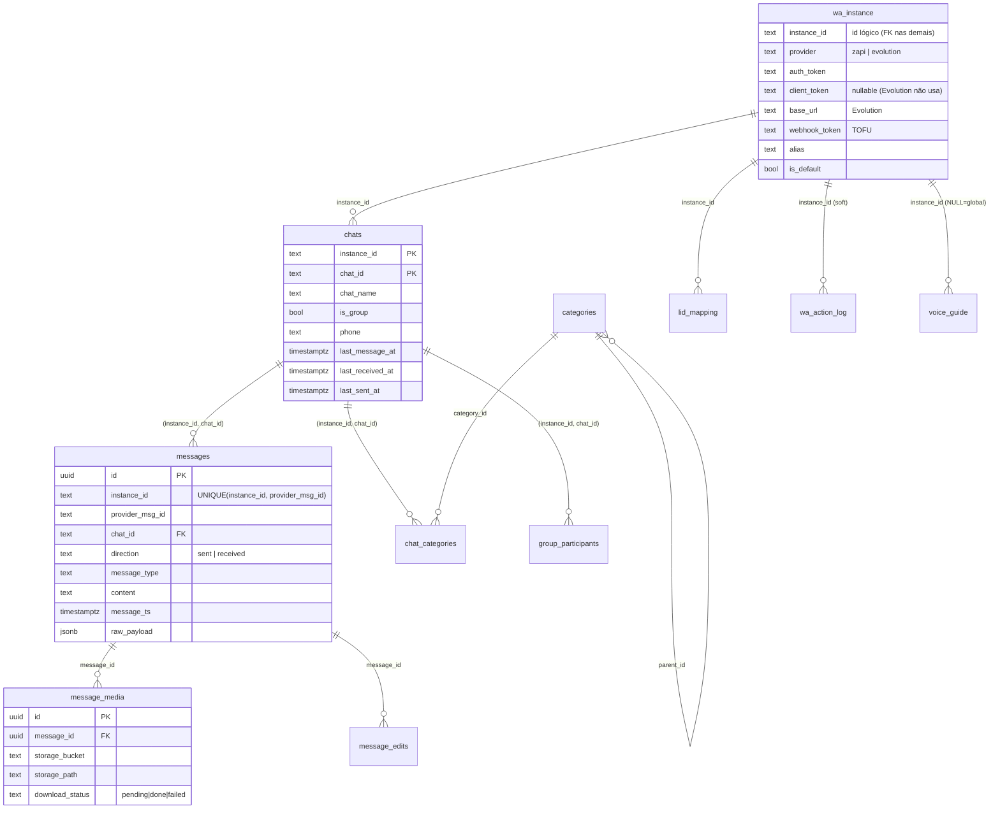

# Esquema do banco (Postgres / Supabase)

Referência do banco do WhatsApp Agent: tabelas, views, functions, triggers, cron jobs, RLS, Storage e a linha do tempo das migrations. **Fonte de verdade:** os arquivos em [`supabase/migrations/`](../../supabase/migrations/). Este documento descreve o **estado atual** (após a migration 0040) e anota a migration que introduziu cada coisa.

> **Convenção multi-instância (desde 0027/0028):** quase toda tabela de dados carrega `instance_id` e usa **chave composta** `(instance_id, …)`. Isso permite que o dono tenha mais de um número de WhatsApp (ex.: pessoal + profissional) no mesmo banco, inclusive falando entre si. `instance_id` é FK para `wa_instance.instance_id`.

---

## Visão geral (ERD)

Tabelas sem aresta direta no diagrama por serem logs/auxiliares: `webhook_events_raw` (log bruto de webhooks), `message_reactions` (emojis), `wa_action_log` (auditoria de ações via MCP, particionada).

---

## Tabelas

### `wa_instance` — instâncias de WhatsApp
Origem: [0001](../../supabase/migrations/0001_schema_core.sql) (como `zapi_instance`); colunas adicionais em [0027](../../supabase/migrations/0027_multi_instance_additive.sql), [0029](../../supabase/migrations/0029_per_instance_webhook_token.sql); renomeada para `wa_instance` + `provider`/`base_url` em [0040](../../supabase/migrations/0040_provider_neutralization.sql).

Uma linha por número de WhatsApp conectado. É a tabela que decide **qual provedor** e **quais credenciais** usar.

| Coluna | Tipo | Descrição |
|---|---|---|
| `id` | UUID PK | Identificador interno |
| `instance_id` | TEXT UNIQUE | ID da instância — usado como FK em todas as tabelas de dados |
| `provider` | TEXT | `zapi` ou `evolution` (CHECK `wa_instance_provider_check`). Default `zapi` |
| `auth_token` | TEXT | Token de autenticação (era `token` até a 0040) |
| `client_token` | TEXT (nullable) | Client-Token da Z-API. Nullable desde 0040 (Evolution não usa) |
| `base_url` | TEXT | Base URL do servidor (customização Evolution) |
| `webhook_url` | TEXT | URL do webhook configurada no provedor |
| `webhook_token` | TEXT | Senha do webhook **por instância** (header `z-api-token`), aprendida via TOFU pelo `process-webhook` (0029) |
| `phone_connected` | TEXT | Número conectado |
| `alias` | TEXT UNIQUE | Nome legível (ex.: `pessoal`, `profissional`) (0027) |
| `is_default` | BOOLEAN | Instância padrão (usada no backfill da 0028) (0027) |
| `default_voice_id` | TEXT | Voz TTS default do `send-voice` quando o request não especifica (0046) |
| `humanize_enabled` | BOOLEAN | Escolha do onboarding: `false` desliga a humanização oral do `send-voice` na instância, sobrepondo o nível do perfil (0052) |
| `is_active`, `last_connected_at`, `last_disconnected_at` | — | Estado da conexão |
| `created_at`, `updated_at` | TIMESTAMPTZ | Trigger `set_updated_at` em `updated_at` |

Trigger: `trg_zapi_instance_updated` → `set_updated_at()`.

### `chats` — conversas (1:1, grupo, comunidade)
Origem: [0001](../../supabase/migrations/0001_schema_core.sql); `last_received_at`/`last_sent_at` em [0008](../../supabase/migrations/0008_last_received_sent_at.sql); `linked_pipedrive_person_id` em [0011](../../supabase/migrations/0011_categories.sql); índices em [0009](../../supabase/migrations/0009_chats_indexes.sql); PK composta em [0028](../../supabase/migrations/0028_multi_instance_composite_keys.sql).

**PK:** `(instance_id, chat_id)`.

| Coluna | Tipo | Descrição |
|---|---|---|
| `instance_id`, `chat_id` | TEXT | PK composta |
| `chat_name` | TEXT | Nome do chat/contato/grupo |
| `is_group`, `is_community`, `is_announcement` | BOOLEAN | Tipo do chat |
| `phone` | TEXT | Número (1:1) |
| `profile_thumbnail`, `member_count`, `description` | — | Metadados de perfil/grupo |
| `last_message_at` | TIMESTAMPTZ | Última mensagem (qualquer direção) — ordena a inbox |
| `last_received_at` | TIMESTAMPTZ | Última **recebida** (`from_me=false`) — base do "estou devendo resposta" |
| `last_sent_at` | TIMESTAMPTZ | Última **enviada** (`from_me=true`) |
| `linked_pipedrive_person_id` | BIGINT (nullable) | FK soft para o Pipedrive (sem constraint) |

Índices: `idx_chats_phone`, `idx_chats_name_trgm` (GIN trigram para `ilike`), `idx_chats_last_message_at`, `idx_chats_last_received_at`, `idx_chats_pipedrive_person` (parcial). Trigger: `trg_chats_updated`.

### `messages` — todas as mensagens (o centro do sistema) ⭐
Origem: [0001](../../supabase/migrations/0001_schema_core.sql); campos de envio em [0004](../../supabase/migrations/0004_messages_send_fields.sql); `raw_type_hint` em [0010](../../supabase/migrations/0010_raw_type_hint.sql); `sent_by_agent_name` em [0012](../../supabase/migrations/0012_sent_by_agent_name.sql); índice global `message_ts` em [0013](../../supabase/migrations/0013_messages_message_ts_index.sql); chave composta em [0028](../../supabase/migrations/0028_multi_instance_composite_keys.sql)/[0029](../../supabase/migrations/0029_per_instance_webhook_token.sql).

**É aqui que as mensagens caem.** PK: `id` (UUID). **UNIQUE:** `(instance_id, provider_msg_id)` — a mesma mensagem do WhatsApp pode existir em duas instâncias (uma como `sent`, outra como `received`).

| Coluna | Tipo | Descrição |
|---|---|---|
| `id` | UUID PK | |
| `instance_id` | TEXT NOT NULL | Instância de origem |
| `provider_msg_id` | TEXT | ID da mensagem no WhatsApp |
| `chat_id` | TEXT | FK composta `(instance_id, chat_id)` → `chats` (ON DELETE CASCADE) |
| `direction` | TEXT | `sent` ou `received` (CHECK) |
| `from_me` | BOOLEAN | Atalho de filtro (redundante com `direction`) |
| `sender_phone`, `sender_name` | TEXT | Remetente |
| `message_type` | TEXT | `text`, `image`, `audio`, `ptt`, `video`, `document`, `sticker`, `location`, `contact`, `poll`, `reaction`, `unknown`, … |
| `content` | TEXT | Texto (ou transcrição de áudio quando preenchido pelo `transcribe-queue`) |
| `caption` | TEXT | Legenda de mídia |
| `quoted_msg_id` | TEXT | Mensagem citada |
| `is_forwarded`, `is_edited`, `is_deleted` | BOOLEAN | Flags |
| `message_ts` | TIMESTAMPTZ | Timestamp **original** do WhatsApp (cronologia correta, inclusive em imports) |
| `raw_payload` | JSONB | Payload bruto recebido |
| `raw_type_hint` | TEXT | Pista de tipo quando `message_type='unknown'` |
| `send_status` | TEXT | `pending`/`sent`/`delivered`/`read`/`failed` (envios) |
| `send_error` | TEXT | Erro de envio |
| `sent_by_agent` | BOOLEAN | Enviada via MCP? |
| `agent_request_id` | UUID | ID de idempotência da requisição do MCP |
| `sent_by_agent_name` | TEXT | Qual instância MCP enviou (ex.: `claude-code-vps`). NULL = enviado do celular |
| `created_at` | TIMESTAMPTZ | Inserção no banco |

Índices: `idx_messages_inst_chat_ts` (`(instance_id, chat_id, message_ts DESC)`), `idx_messages_message_ts` (global), `idx_messages_provider_id`, `idx_messages_type`, `idx_messages_from_me`, `idx_messages_send_status` (parcial), `idx_messages_agent` (parcial), `idx_messages_agent_name` (parcial), `idx_messages_raw_type_hint` (parcial), `idx_messages_pending_audio` (parcial — acelera o batch de transcrição, [0015](../../supabase/migrations/0015_index_pending_audio.sql)).

### `message_media` — mídia das mensagens
Origem: [0001](../../supabase/migrations/0001_schema_core.sql). PK `id`. FK `message_id` → `messages` (CASCADE).

Os bytes ficam no **Storage**; esta tabela guarda o ponteiro e o estado do download. Campos: `mime_type`, `storage_bucket`, `storage_path`, `original_url`, `file_size_bytes`, `duration_seconds`, `width`/`height`, `thumbnail_path`, `download_status` (`pending`/`done`/`failed`), `download_error`.

Trigger: `trg_transcribe_on_media_done` (AFTER UPDATE OF `download_status`) → dispara transcrição quando o download de áudio privado conclui (ver [Functions](#functions-plpgsql)).

### `message_reactions` — emojis
Origem: [0001](../../supabase/migrations/0001_schema_core.sql); UNIQUE composta em [0028](../../supabase/migrations/0028_multi_instance_composite_keys.sql). **UNIQUE:** `(instance_id, target_msg_id, reactor_phone)`. Campos: `target_msg_id`, `chat_id`, `reactor_phone`, `reactor_name`, `emoji`, `from_me`, `reacted_at`, `raw_payload`.

### `message_edits` — histórico de edições
Origem: [0001](../../supabase/migrations/0001_schema_core.sql). FK `message_id` → `messages` (CASCADE). Campos: `previous_content`, `new_content`, `edited_at`.

### `group_participants` — membros de grupos
Origem: [0001](../../supabase/migrations/0001_schema_core.sql); UNIQUE composta em [0028](../../supabase/migrations/0028_multi_instance_composite_keys.sql). **UNIQUE:** `(instance_id, chat_id, phone)`. FK composta → `chats`. Campos: `phone`, `name`, `is_admin`, `is_super_admin`, `joined_at`, `left_at` (NULL = ainda no grupo).

### `categories` — taxonomia de categorias
Origem: [0011](../../supabase/migrations/0011_categories.sql). PK `id` (BIGSERIAL). `slug` UNIQUE com CHECK de normalização (`^[a-z0-9_-]+$`, lowercase). Campos: `label`, `color`, `description`, `parent_id` (hierarquia opcional). **Seed inicial:** `pessoal`, `familia`, `saude`, `trabalho`, `cliente`, `prospect`, `fornecedor`, `comunidade`, `descartar`.

### `chat_categories` — ligação N:N chat ↔ categoria
Origem: [0011](../../supabase/migrations/0011_categories.sql); PK composta em [0028](../../supabase/migrations/0028_multi_instance_composite_keys.sql). **PK:** `(instance_id, chat_id, category_id)`. Campos: `assigned_at`, `assigned_by` (`manual` | `llm` | `rule:<nome>`), `confidence` (0–1, para atribuição LLM), `notes`.

### `lid_mapping` — LID (Multi-Device) → telefone real
Origem: [0016](../../supabase/migrations/0016_lid_mapping.sql); PK composta em [0028](../../supabase/migrations/0028_multi_instance_composite_keys.sql). **PK:** `(instance_id, lid)`. A Z-API entrega `phone="<lid>@lid"` em mensagens enviadas de dispositivo linkado; sem este mapa, cada contato vira um chat duplicado. Campos: `phone`, `chat_name`, `resolved_via` (`cache`/`chat_name`/`zapi`/`manual`), `resolved_at`.

### `webhook_events_raw` — log bruto de webhooks (debug/replay)
Origem: [0001](../../supabase/migrations/0001_schema_core.sql); `was_waiting` em [0017](../../supabase/migrations/0017_waiting_message_tracking.sql). Toda requisição de webhook é gravada aqui antes do processamento. Campos: `event_type`, `payload` (JSONB), `processed`, `error`, `was_waiting` (webhook chegou sem decriptar — E2E pendente), `received_at`, `processed_at`. Índices: `idx_webhook_raw_received`, `idx_webhook_raw_unprocessed` (parcial), `idx_webhook_raw_was_waiting` (parcial). Limpeza: cron remove processados > 7 dias.

### `wa_action_log` — auditoria de ações via MCP (particionada)
Origem: [0018](../../supabase/migrations/0018_zapi_action_log.sql) (como `zapi_action_log`); renomeada em [0040](../../supabase/migrations/0040_provider_neutralization.sql). **PK:** `(id, called_at)`, **particionada por RANGE(`called_at`)** (mensal). Registra cada chamada de ação: `agent_request_id` (idempotência 24h), `action`, `category` (`read`/`write`/`destructive`/`rejected`), `params`, `method`, `instance_id` (nullable — fallback de auditoria), `result_status`, `result_body`, `error`, `agent_name`, `duration_ms`. **Retenção:** 90 dias (DROP automático de partições). As partições filhas mantêm o prefixo `zapi_action_log_YYYY_MM` (a 0040 não as renomeia — são internas).

### `voice_guide` — guia de voz do dono
Origem: [0030](../../supabase/migrations/0030_voice_guide.sql). Markdown que descreve como o dono se comunica, consumido pela `mcp-api`. Single-tenant: uma linha global (`instance_id` NULL) ou uma por instância. UNIQUE em `COALESCE(instance_id,'__global__')`.

### `scheduled_sequences` — sequências de mensagens agendadas
Origem: [0049](../../supabase/migrations/0049_scheduled_sequences.sql). Uma linha = uma sequência de 1..10 mensagens (`items` JSONB — shape espelha os params de `send`/`send_voice`/`send-poll`) agendada pra envio único futuro em um chat/instância. Criada pela tool `schedule` da `mcp-api` (gate `confirmed` satisfeito na criação); drenada pelo worker [`dispatch-scheduled`](../../supabase/functions/dispatch-scheduled/index.ts) (cron 1/min). Campos-chave: `scheduled_at` (timestamptz), `status` (`pending`/`processing`/`sent`/`failed`/`canceled`), `items_sent` (cursor de progresso/resume — em falha, o item que falhou é `items[items_sent]`), `error`, `started_at`/`finished_at`. Índice parcial `idx_scheduled_sequences_due` (`scheduled_at WHERE status='pending'`) pro worker. Itens imutáveis: editar = `cancel_scheduled` + `schedule` de novo.

### Tabelas removidas
- `presence_events` — removida em [0022](../../supabase/migrations/0022_drop_presence_events.sql) (≈216 MB de dado morto + cron de limpeza).
- `contacts` e `oauth_tokens` — removidas em [0023](../../supabase/migrations/0023_remove_google_contacts_sync.sql) (sync do Google Contacts nunca foi populado). O CASCADE quebrou views, recriadas em [0024](../../supabase/migrations/0024_recreate_v_chats_with_contact.sql)/[0026](../../supabase/migrations/0026_recreate_v_messages_with_sender.sql).

---

## Views

| View | Origem | O que expõe |
|---|---|---|
| `v_chats_with_contact` | 0003, recriada 0024/0028 | `chats.*` + `contact_name = chat_name` (e colunas legadas de contato em NULL). Usada pelo MCP para listar/buscar chats |
| `v_messages_with_sender` | 0003, recriada 0026/0028 | `messages.*` + `sender_contact_name`, `chat_display_name`, `chat_is_group` (JOIN com `chats`). Usada pelo comando `read` |
| `v_chats_with_categories` | 0011, recriada 0028 | Por chat: arrays `category_slugs[]` e `category_labels[]`. Permite filtro `WHERE category_slugs && ARRAY['cliente','prospect']` |
| `v_waiting_messages_status` | 0017 | Webhooks `waitingMessage`: `resolved` (follow-up chegou) / `pending` (<24h) / `lost` (>24h sem follow-up) |
| `zapi_instance` *(shim)* | 0040 | Compat: alias de `wa_instance` que reexpõe `auth_token` como `token`. **Deprecada** |
| `zapi_action_log` *(shim)* | 0040 | Compat: `SELECT * FROM wa_action_log`. **Deprecada** |

---

## Functions (plpgsql)

| Função | Origem | O que faz |
|---|---|---|
| `set_updated_at()` | 0001 | Trigger genérico: `NEW.updated_at = now()`. Usada por `wa_instance` e `chats` |
| `call_edge_function(path TEXT)` | 0001 | **Ponte Postgres → Edge Function.** `SECURITY DEFINER`. Lê `project_url` + `service_role_key` do **Supabase Vault** em runtime e faz `net.http_post`. Se o Vault não estiver populado, apenas emite `NOTICE` e retorna NULL (não quebra cron/trigger). Usada por todos os cron jobs e pelo trigger de transcrição |
| `trigger_transcribe_on_media_done()` | 0014, recriada 0028 | Trigger em `message_media`: quando `download_status` vira `done` e a mensagem é `ptt`/`audio` **privada** sem `content`, chama `/functions/v1/transcribe-queue?id=<message_id>` (transcrição imediata, ~3–5 s) |
| `create_zapi_action_log_partition_next_month()` | 0018, corrigida 0040 | Cria a partição do mês seguinte de `wa_action_log` |
| `drop_zapi_action_log_partitions_older_than_90d()` | 0018, corrigida 0040 | Dropa partições de `wa_action_log` com upper bound > 90 dias |

---

## Triggers

| Trigger | Tabela | Evento | Função |
|---|---|---|---|
| `trg_zapi_instance_updated` | `wa_instance` | BEFORE UPDATE | `set_updated_at()` |
| `trg_chats_updated` | `chats` | BEFORE UPDATE | `set_updated_at()` |
| `trg_transcribe_on_media_done` | `message_media` | AFTER UPDATE OF `download_status` | `trigger_transcribe_on_media_done()` |

---

## Cron jobs (pg_cron)

Todos rodam em **UTC**. Os que chamam Edge Functions usam `call_edge_function` + Vault.

| Job | Schedule | Ação |
|---|---|---|
| `transcribe-audio-queue` | `*/2 * * * *` | `→ /functions/v1/transcribe-queue` (Whisper) — [0007](../../supabase/migrations/0007_transcribe_queue_cron.sql) |
| `retry-pending-media` | `*/15 * * * *` | `→ /functions/v1/retry-media` — [0005](../../supabase/migrations/0005_pg_cron_jobs.sql) |
| `cleanup-webhook-raw` | `15 3 * * *` | `DELETE webhook_events_raw` processados > 7 dias — [0005](../../supabase/migrations/0005_pg_cron_jobs.sql) |
| `cleanup-heavy-media` | `30 3 * * *` | `→ /functions/v1/cleanup-media` (áudio > 30 dias) — [0005](../../supabase/migrations/0005_pg_cron_jobs.sql) |
| `zapi-action-log-partition-create` | `0 3 25 * *` | Cria partição do mês seguinte — [0019](../../supabase/migrations/0019_zapi_action_log_cron.sql) |
| `zapi-action-log-partition-drop` | `0 4 1 * *` | Dropa partições > 90 dias — [0019](../../supabase/migrations/0019_zapi_action_log_cron.sql) |
| `dispatch-scheduled` | `* * * * *` | `→ /functions/v1/dispatch-scheduled` (sequências de mensagens agendadas vencidas) — [0049](../../supabase/migrations/0049_scheduled_sequences.sql) |

> **Removidos:** `cleanup-presence-events` (0022) e `sync-google-contacts` (0023).

---

## Extensões, RLS e Storage

**Extensões** ([0001](../../supabase/migrations/0001_schema_core.sql), [0003](../../supabase/migrations/0003_contacts_and_oauth.sql)/[0009](../../supabase/migrations/0009_chats_indexes.sql)): `pgcrypto` (UUIDs), `pg_net` (HTTP do Postgres), `pg_cron` (agendador), `pg_trgm` (busca trigram em `chat_name`).

**RLS** ([0006](../../supabase/migrations/0006_enable_rls.sql)): single-tenant. RLS habilitado em todas as tabelas `public`, **sem policies** → bloqueia `anon`/`authenticated` por padrão; só a `service_role` (Edge Functions, MCP) acessa. Reforçado com `REVOKE ALL` + `ALTER DEFAULT PRIVILEGES`.

**Storage** ([0002](../../supabase/migrations/0002_storage_buckets.sql)): 6 buckets **privados**. Convenção de path `{chat_id}/{provider_msg_id}.<ext>`.

| Bucket | Conteúdo |
|---|---|
| `whatsapp-audio` | Áudio / PTT (`.ogg`) |
| `whatsapp-images` | Imagens (`.jpg`) |
| `whatsapp-video` | Vídeos (`.mp4`) |
| `whatsapp-documents` | Documentos (`-{filename}`) |
| `whatsapp-stickers` | Stickers (`.webp`) |
| `whatsapp-thumbnails` | Thumbnails (`.jpg`) |

---

## Linha do tempo das migrations

| # | Arquivo | Introduziu |
|---|---|---|
| 0001 | `schema_core` | Extensões; `call_edge_function`/`set_updated_at`; tabelas core (`zapi_instance`, `chats`, `messages`, `message_media`, `message_reactions`, `message_edits`, `presence_events`, `group_participants`, `webhook_events_raw`) |
| 0002 | `storage_buckets` | 6 buckets de mídia privados |
| 0003 | `contacts_and_oauth` | `contacts` + `oauth_tokens`; views `v_chats_with_contact`, `v_messages_with_sender` *(tabelas removidas na 0023)* |
| 0004 | `messages_send_fields` | `send_status`, `send_error`, `sent_by_agent`, `agent_request_id` |
| 0005 | `pg_cron_jobs` | Crons `cleanup-webhook-raw`, `cleanup-heavy-media`, `retry-pending-media` |
| 0006 | `enable_rls` | RLS em todas as tabelas + REVOKE de anon/authenticated |
| 0007 | `transcribe_queue_cron` | Cron `transcribe-audio-queue` (2 min) |
| 0008 | `last_received_sent_at` | `last_received_at` / `last_sent_at` em `chats` |
| 0009 | `chats_indexes` | Índices de `chats` (phone, trigram, last_*) |
| 0010 | `raw_type_hint` | `raw_type_hint` em `messages` |
| 0011 | `categories` | `categories` + `chat_categories` + `v_chats_with_categories`; `linked_pipedrive_person_id` |
| 0012 | `sent_by_agent_name` | `sent_by_agent_name` em `messages` |
| 0013 | `messages_message_ts_index` | Índice global `message_ts` |
| 0014 | `transcribe_on_media_done_trigger` | Trigger de transcrição imediata |
| 0015 | `index_pending_audio` | Índice parcial de áudios pendentes |
| 0016 | `lid_mapping` | Tabela `lid_mapping` |
| 0017 | `waiting_message_tracking` | `was_waiting` + view `v_waiting_messages_status` |
| 0018 | `zapi_action_log` | `zapi_action_log` (particionada) + funções de partição |
| 0019 | `zapi_action_log_cron` | Crons de criação/drop de partições |
| 0022 | `drop_presence_events` | **Remove** `presence_events` + cron |
| 0023 | `remove_google_contacts_sync` | **Remove** `contacts`/`oauth_tokens` + cron |
| 0024 | `recreate_v_chats_with_contact` | Hotfix da view (pós-CASCADE) |
| 0026 | `recreate_v_messages_with_sender` | Hotfix da view (pós-CASCADE) |
| 0027 | `multi_instance_additive` | `instance_id` nullable nas tabelas; `alias`/`is_default` em `zapi_instance` |
| 0028 | `multi_instance_composite_keys` | Backfill + PKs/UNIQUEs compostas `(instance_id, …)`; recria trigger e views |
| 0029 | `per_instance_webhook_token` | `webhook_token` por instância; UNIQUE `(instance_id, provider_msg_id)` |
| 0030 | `voice_guide` | Tabela `voice_guide` |
| 0031 | `merge_ninth_digit_ghosts` | Função `merge_ninth_digit_ghosts` (funde chats fantasmas do 9º dígito BR) |
| 0032 | `voice_checks` | Coluna `checks` na `voice_guide` (calibração pessoal do voice check) |
| 0033 | `nurture_state` | Cursor da rotina de nutrição de contatos |
| 0034 | `nurture_backfill` | Controle do backfill de nutrição |
| 0035 | `chat_voice_profile` | `chats.voice_profile` JSONB (perfil de voz por contato) |
| 0035 | `social_graph_state` | *(duplicada pelo squash do PR #5 — reaplicada como 0039)* |
| 0036 | `chat_brain_contact` | `chats.brain_contact_id` (vínculo com o Expert Brain) |
| 0037 | `sent_by_agent_from_api` | `sent_by_agent` a partir do `fromApi` do webhook |
| 0038 | `voice_profile_como_chamo` | `voice_profile.como_chamo` |
| 0039 | `social_graph_state` | Cursor do grafo social de interações |
| 0040 | `provider_neutralization` | Rename `zapi_*`→`wa_*`, `token`→`auth_token`; `provider`/`base_url`; views shim de compat |
| 0041 | `chats_waiting_on` | `waiting_on` computado no banco (o inbox filtrava em memória) |
| 0042 | `contact_profile_cache` | Cache de recado (`about`) + perfil business em `chats` (refresh lazy TTL 7d) |
| 0043 | `backfill_direction_timestamps` | Backfill de `last_received_at`/`last_sent_at` do histórico pré-0008 |
| 0044 | `waiting_on_groups_off` | Grupo nunca entra na semântica de "quem espera resposta" |
| 0045 | `chat_resolve_snooze` | Modelo Zendesk: `resolved_at`/`snooze_until` em `chats` (tool `resolve_chat`) |
| 0046 | `instance_default_voice` | `wa_instance.default_voice_id` (voz TTS default por instância) |
| 0047 | `categories_alinhamento_vault` | Seed de categorias de segmento alinhadas ao vault de contatos (`aluno`, `network`, `vip`) |
| 0048 | `categoria_mapear` | Seed da categoria operacional `mapear` (grupo alimenta o mapeamento de contatos) |
| 0049 | `scheduled_sequences` | Tabela `scheduled_sequences` + cron `dispatch-scheduled` (1 min) — agendamento de sequências de mensagens |
| 0050 | `enable_rls_remaining` | RLS nas tabelas que ficaram sem (advisor): `lid_mapping`, `wa_action_log` (+partições), `nurture_*`, `social_graph_state` |
| 0051 | `voice_profiles` | Tabela `voice_profiles`: catálogo de perfis de voz TTS — `send-voice` resolve `profile` e trava voice/settings server-side; `humanize` = nível de oralização |
| 0052 | `instance_humanize_toggle` | `wa_instance.humanize_enabled` (escolha do onboarding): `false` força texto literal no `send-voice`, sobrepondo o nível do perfil |

---

**Próximo:** veja [ARQUITETURA.md](ARQUITETURA.md) para como esses dados são escritos/lidos (Edge Functions + fluxo de mensagens) e [MCP.md](MCP.md) para as tools que o Claude usa.
